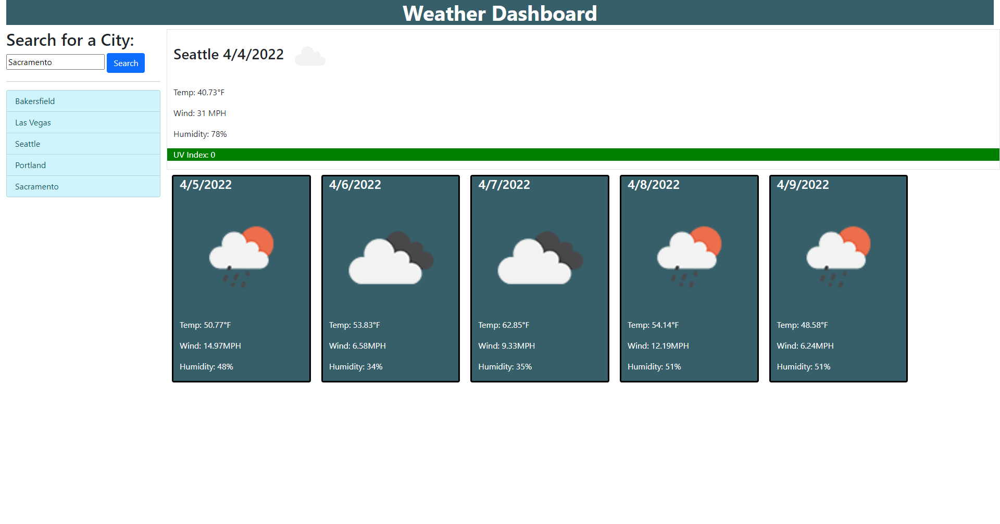

# Server-Side APIs Challenge: Weather Dashboard
[](https://bootcamp.msu.edu/)

## Description
Our task is to build a weather dashboard that will run in the browser and feature dynamically updated HTML and CSS. We will use the [OpenWeather One Call API](https://openweathermap.org/api/one-call-api) to retrieve weather data for the cities. We will also use `localStorage` to store any persistent data.

## User Story
```
AS A traveler
I WANT to see the weather outlook for multiple cities
SO THAT I can plan a trip accordingly
```

## Acceptance Criteria
```
GIVEN a weather dashboard with form inputs
WHEN I search for a city
THEN I am presented with current and future conditions for that city and that city is added to the search history
WHEN I view current weather conditions for that city
THEN I am presented with the city name, the date, an icon representation of weather conditions, the temperature, the humidity, the wind speed, and the UV index
WHEN I view the UV index
THEN I am presented with a color that indicates whether the conditions are favorable, moderate, or severe
WHEN I view future weather conditions for that city
THEN I am presented with a 5-day forecast that displays the date, an icon representation of weather conditions, the temperature, the wind speed, and the humidity
WHEN I click on a city in the search history
THEN I am again presented with current and future conditions for that city
```

## Screenshot
Here is a preview of the website before running the weather api: 
Here is a preview of the website after running the weather api: 


## Link

A link to the [code](https://github.com/jgarcia45/weather-dashboard):
```
https://github.com/jgarcia45/weather-dashboard
```

A link to the deployed [URL](https://jgarcia45.github.io/weather-dashboard/):
```
https://jgarcia45.github.io/weather-dashboard/
```

